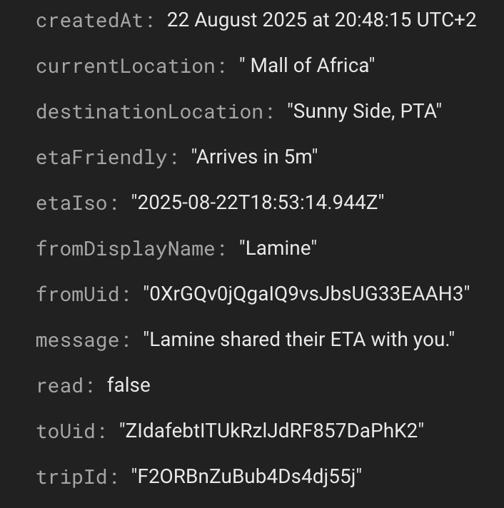
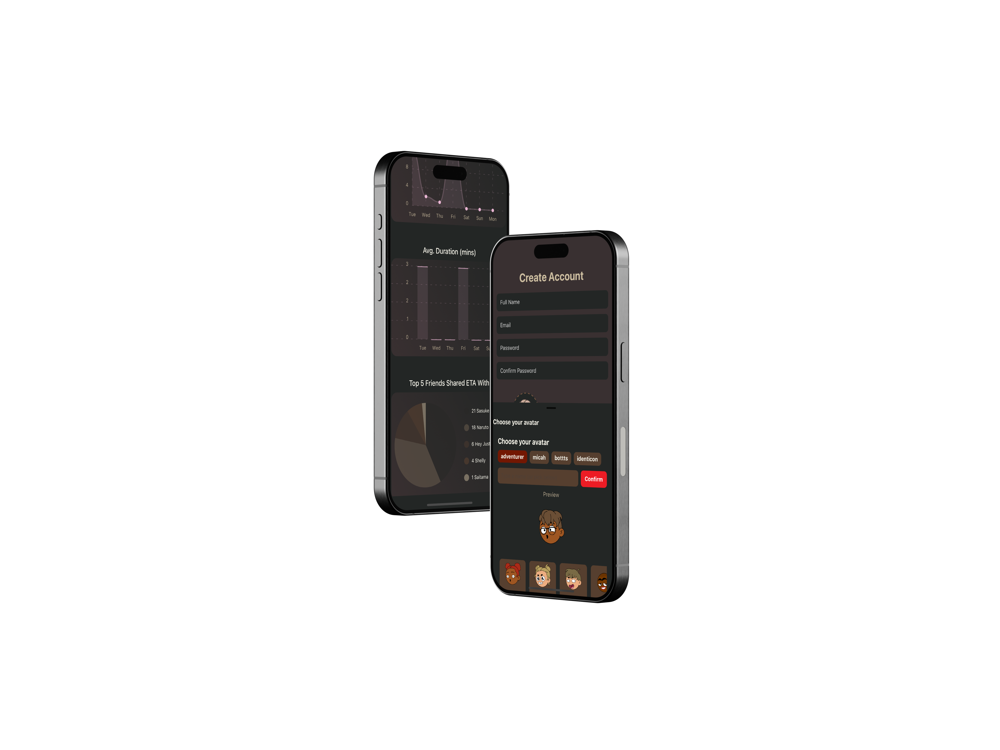

<!-- Repository Information & Links-->
<br />


<!--  -->


<!-- HEADER SECTION -->
<h5 align="center" style="padding:0;margin:0;">Tsebo Ramonyalioa</h5>
<h5 align="center" style="padding:0;margin:0;">200200</h5>
<h6 align="center">DV300 - Semester 2 - Term 3 | 2025</h6>
</br>
<p align="center">

  <a href="https://github.com/Tsebo200/ShieldMe">
    
  </a>
  
  <h3 align="center">ShieldMe</h3>

  <p align="center">
    A Safety Mobile Application to help people get from point A to point B as safely as possible<br>
    
   <br />
   <br />
   <a href="https://youtu.be/n6tIJBcqQvo">View Demo</a>
    ·
    <a href="https://github.com/Tsebo200/ShieldMe/issues">Report Bug</a>
    ·
    <a href="https://github.com/Tsebo200/ShieldMe/issues">Request Feature</a>
</p>
<!-- TABLE OF CONTENTS -->

## Table of Contents

* [About the Project](#about-the-project)
  * [Project Description](#project-description)
  * [Built With](#built-with)
* [Getting Started](#getting-started)
  * [Prerequisites](#prerequisites)
  * [How to install](#how-to-install)
* [Features and Functionality](#features-and-functionality)
* [Concept Process](#concept-process)
   * [Ideation](#ideation)
   * [Wireframes](#wireframes)
   * [Custom UI](#user-flow)
* [Development Process](#development-process)
   * [Implementation Process](#implementation-process)
        * [Highlights](#highlights)
        * [Challenges](#challenges)
   * [Future Implementation](#peer-reviews)
* [Final Outcome](#final-outcome)
    * [Mockups](#mockups)
    * [Video Demonstration](#video-demonstration)
* [Conclusion](#conclusion)
* [License](#license)
* [Contact](#contact)
* [Acknowledgements](#acknowledgements)

<!--PROJECT DESCRIPTION-->


### Project Description

A safety mobile application built with Expo Go that is gesture driven with drag and drop with no trational UI buttons integrated with Firebase while written in Typescript

### Built With

The REFT Stack

* React Native[&nbsp;&nbsp;&nbsp;&nbsp;&nbsp;&nbsp;&nbsp;&nbsp;](https://reactnative.dev/)

* Expo Go[&nbsp;&nbsp;&nbsp;&nbsp;&nbsp;&nbsp;&nbsp;&nbsp;](https://expo.dev/go)

* Firebase[&nbsp;&nbsp;&nbsp;&nbsp;&nbsp;&nbsp;&nbsp;&nbsp;](https://firebase.google.com)

* Typescript[&nbsp;&nbsp;&nbsp;&nbsp;&nbsp;&nbsp;&nbsp;&nbsp;](https://www.typescriptlang.org/)


<!-- GETTING STARTED -->
<!-- Make sure to add appropriate information about what prerequesite technologies the user would need and also the steps to install your project on their own machines -->
## Getting Started

The following instructions will get you a copy of the project up and running on your local machine for development and testing purposes.

### Prerequisites

Ensure that you have the latest version of [NPM](https://www.npmjs.com/) installed on your machine. The [GitHub Desktop](https://desktop.github.com/) program will also be required. 

### How to install

### Installation
Here are a couple of ways to clone this repo:

1. GitHub Desktop </br>
Enter `https://github.com/Tsebo200/ShieldMe.git` into the URL field and press the `Clone` button.

2. Clone Repository </br>
Run the following in the command-line to clone the project:
   ```sh
   git clone https://github.com/Tsebo200/ShieldMe.git
   ```
    Open `Software` and select `File | Open...` from the menu. Select cloned directory and press `Open` button

3. Install Dependencies </br>
Run the following in the command-line to install all the required dependencies:
   ```sh
   npm install
   ```

4. Enviroment Variables
Create a .env file and place it in the root of projct
```sh
FIREBASE_API_KEY=your_api_key
FIREBASE_AUTH_DOMAIN=your_project.firebaseapp.com
FIREBASE_PROJECT_ID=your_project_id
FIREBASE_STORAGE_BUCKET=your_project.appspot.com
FIREBASE_MESSAGING_SENDER_ID=your_sender_id
FIREBASE_APP_ID=your_app_id
```

<!-- FEATURES AND FUNCTIONALITY-->
<!-- You can add the links to all of your imagery at the bottom of the file as references -->
## Features and Functionality

<!-- note how you can use your gitHub link. Just make a path to your assets folder -->
<!-- ### Feature  -->

## Login Screen
- Firebase Auth so that only authenticated users can login 
- Error messages added 

## Register Screen
- Firebase Auth so that every Register entered get authenticated and added to users collection
- Validation & Error messages added

## Trip Screen 
- Where user enters their trip details

## Timer Screen
- Live Countdown of ETA showing time remaining
- Current location tracking — app records and (optionally but recommendable) shares current GPS When ETA expires.

## ETA Share Screen
- Select friends — choose recipients from an in-app friends list (drag-and-drop selection flow).
- Share ETA — send live ETA updates to selected friends (permission-based).

## Dashboard Screen
- Live updates — periodic updates to shared friends when location/ETA state changes.

## Trip Insights Screen
- Summary of your Trips 
  - Trips of the week
  - Average ETA per trip
  - Most shared ETA 
## Profile Screen
  - LogOut User
  - Navigation to Friends

## Friends Screen
- Add & Remove Friends 
- Firebase subscribe & unsubscribe utilised

## Puzzle Screen
- short interactive puzzle (drag/drop) to confirm arrival.
- completing the puzzle marks the trip as completed in Firestore.
- if puzzle not completed within a timeout, optionally notify friends or escalate.

## Trip state in Firestore
- Trips collection — store uid, currentLocation, destinationLocation, eta, sharedFriends, startTime, endTime, duration, status (ongoing | completed | cancelled).
- Permissions — rules to restrict reads/writes to authorized users.

## No-traditional-buttons interaction model
- Drag & drop friend selection — pick and drag friend cards into a share area.

<!-- Admin Page with CRUD for oil products<br> -->

<!--  <br><br> -->

 <!-- The authentication is displayed in modals (the navy labels). The modals disappear while the user enters their information. <br> -->

<!-- <br><br> -->

 <!-- The logout feature button is on the navigation bar for the user, as this is a security feature that avoids the user being hacked, making our database vulnerable and the user. When the user clicks on the button they are redirected to the sign in page and their session is cleared from the website.<br> -->

<!-- <br><br> -->

<!-- ### Functionality  -->
<!-- A useNavigate hook was utilised so that when the user clicks on the sign in/create account button, they will be redirected to the dashboard and their email address will be added to the local storage. If the user clicked on the create account button their information will be added to the MYSQL database. The opposite will happen whereas if the user tried to redirect to the dashboard without registering or logging in then they will immediately be redirected to the sign in page, a useNavigate and useEffect was utilised to accomplish this function<br><br> -->

<!-- The admin Page
- Create a new product using axios Post request
- Read a product with a card displaying once added to the database with a axios Get request
- Update a products information when tapping on the edit product button on the specific card of the product the axios put request will run
- Deleting a product by tapping on the bin icon the axios delete request will run -->

<!-- The functionality for the logOut button was a useNavigate and a sessionStorage.clear(). -->
<!-- <br><br> -->

<!-- In the patients page there will be a information about the user from the database, specifically, the same user that is signed into the the website.<br><br> -->
<!-- <br><br> -->
<!-- CONCEPT PROCESS -->
<!-- Briefly explain your concept ideation process -->
<!-- here you will add things like wireframing, data structure planning, anything that shows your process. You need to include images-->
## Concept Process

The `Conceptual Process` is the set of actions, activities and research that was done when starting this project. 

<!-- As part of my conceptual process I have sketched wireframes in Figma, I looked at Pinterest for inspiration for colours and I also decided to utilise Material UI for most elements. 
<br><br> -->
Too many kidnapping in South Africa aim to reduce the kidnapping rate especially for in Gauteng. There is also an element of Highjacking 

The aim of the app is to reduce the highjacking and kidnapping rate in South Africa.This app is curated for South African adolescents & young adults who constantly commute to school, college or work by Uber/Bolt, public transportation as well as walking and cycling, Even though ShieldMe is curated for South African adolescents & young adults this app is still applicable for anyone who is commuting from anywhere to anywhere with any form of transportation. These people get worried when they travel especially alone. 

Adolescents and young adults need this app as there are many kidnapping cases to bring awareness of a [Recent Kidnapping of Wits Student](https://www.bbc.com/news/articles/c1e646wjg7zo). Adolescents may find security tedious or boring so the aim to to capture this market by gamifying the app as much as possible

### Ideation
<!-- The style I was going for was a fresh and modern look of websites that would be found on dribble. When I was deciding the type of images I will be utilising, I went for jpegs as that is commonly found on websites, I feel I needed more experience with handling Jpegs as I am used to utilising Svgs and Pngs. -->
<!-- <br><br> -->
The stylitic choice was going for a fresh and modern look so did it with lovely nude colours although to make it interesting with gesture driven interactions this just emphasise the gamifications and fun vibe

### Wireframes
<!-- This is my first phase
<br><br><br>
<br><br><br>
<br><br><br>
<br><br><br>
<br><br><br>
<br><br><br> -->

### Custom UI

The UI is unique so needed to customise it a lot as had to accomodate the gesture driven UI such as Drag & Drop and Swipeables as well
<!-- 
<br>

This is the hover state of my button

<br> -->
<!-- DEVELOPMENT PROCESS -->
## Development Process

The `Development Process` is the technical implementations and functionality done in the frontend and backend of the application. 

<!-- In my frontend I implemented a Google Font called Inter, a box shadow on different sections (content-containers), I added Hover States for my buttons.
<br>In my backend I utilised React.js with PHP. I also created a database with MYSQL and used PHP to communicate to the database. -->

### Implementation Process
<!-- stipulate all of the functionality you included in the project -->
<!-- This is your time to shine, explain the technical nuances of your project, how did you achieve the final outcome!-->

<!-- * Utilised React and SCSS for front-end
* Utilised Express communicate to database for back-end
* Utilised Node for React Packages 
* Implemented Routing with `React-Router v6`.
* Utilised MongoDB as Database (NoSQL) -->
* Utilised React Native for components
* Expo Go started empty template 
* Firebase Services (FireStore & FireAuth) Store data & Autheticate Users
* TypeScript to esnure code is type safe

### Data Flow Diagram
<!-- <br><br><br> -->
### Planned
---


### Final
---
##### Firebase Collections
 

<br>

##### Firebase Users Document


<br>

##### Firebase Trips Document


<br>

##### Firebase ETAShare Document


#### Highlights
<!-- stipulated the highlight you experienced with the project -->
<!-- * I struggled with create/post method and image upload due to Multer Middleware
* I mostly enjoyed making UX decisions and implementing it into the project.
* Learning to send data to MongoDB
* CRUD functionality working -->
I think it was a good decision to start off the project with Trip, Timer and Puzzle screen

I was worried when I got Drag & Drop as the inpiration card although I am glad I got the Drag and Drop and that was thanks to researching a lot during creation of the Project Pitch and that made me feel at ease and helped me plan how to make it functional

Once I got the Create and Read from Firebase I was excited and this occured when trips are being recored and reading them into the react native chart kit 

Once the persistence was working I felt like this is comming up as an actually app

#### Challenges
<!-- stipulated the challenges you faced with the project and why you think you faced it or how you think you'll solve it (if not solved) -->

<!-- * I kept getting a 500 internal error due to the multer middleware -->
I still want to add Notifactions as I found a struggle initially so I switched gears and updated ETA dirrectly within Dashoard View

#### Above And Beyond

What aspects of this final build contribute to the `Above And Beyond` Component of your brief?
<!-- what did you learn outside of the classroom and implement into your project-->
<!-- * New Library Learnt
* I learnt how to use create relationships such as foreign keys and primary keys in sql and I learnt how to use Material UI as well as editing each component with JSS  -->
<br>

### Future Implementation
<!-- stipulate functionality and improvements that can be implemented in the future. -->

<!-- * I would love to learn how to handle with the process of online transactions  -->
- Notifications with Firebase Cloud Messaging
* User Settings (light mode / dark mode / custom mode)
- Edit Profile Information
* TimerCountdown Animations
- Panic Emergency Alerting
* Add Maps as display

<!-- MOCKUPS -->
## Final Outcome

### Mockups
 <!--  -->


<br>


<br>


<br>


<br>


<br>


<br>

  <!--  -->


<!-- VIDEO DEMONSTRATION -->
### Video Demonstration

To see a run through of the application, click below:

[View Demonstration](https://youtu.be/n6tIJBcqQvo)


See the [open issues](https://github.com/Tsebo200/ShieldMe/issues) for a list of proposed features (and known issues).

<!-- AUTHORS -->
## Author

* **Tsebo Ramonyalioa** - [Tsebo200](https://github.com/Tsebo200)

<!-- LICENSE -->
## License

Copyright (c) 2025 Tsebo Ramonyalioa
This project is licensed under the Creative Commons Attribution-NonCommercial 4.0 International License (CC BY-NC 4.0).
See: https://creativecommons.org/licenses/by-nc/4.0/
SPDX: CC-BY-NC-4.0

For commercial use or licensing, please use the contact details below.

<!-- CONTACT -->
## Contact

* **Tsebo Ramonyalioa** - [email@address](mailto:tsebo.ramonyalioa.an@gmail.com) - [@instagram_handle](https://www.instagram.com/inspiration__200/) 
* **Project Link** - https://github.com/Tsebo200/ShieldMe

<!-- ACKNOWLEDGEMENTS -->

## Acknowledgements
* [Lecturer](https://github.com/Armand-OW)
* [Avatar Picker](https://www.dicebear.com/)
* [Drag & Drop](https://www.reddit.com/r/reactnative/comments/1l2ba6i/i_made_a_react_native_drag_and_drop_library_that/)
* [Chart Kit](https://github.com/indiespirit/react-native-chart-kit)
* [Confetti](https://github.com/AlirezaHadjar/react-native-fast-confetti)
* [YouTube](https://www.youtube.com/)
* [Sound Effects](https://freesound.org/)

I am grateful to the [open-source community](https://reactnative.directory/) and the platforms above for the tools and guidance that made this project possible.
<!-- all resources that you used and Acknowledgements here -->


